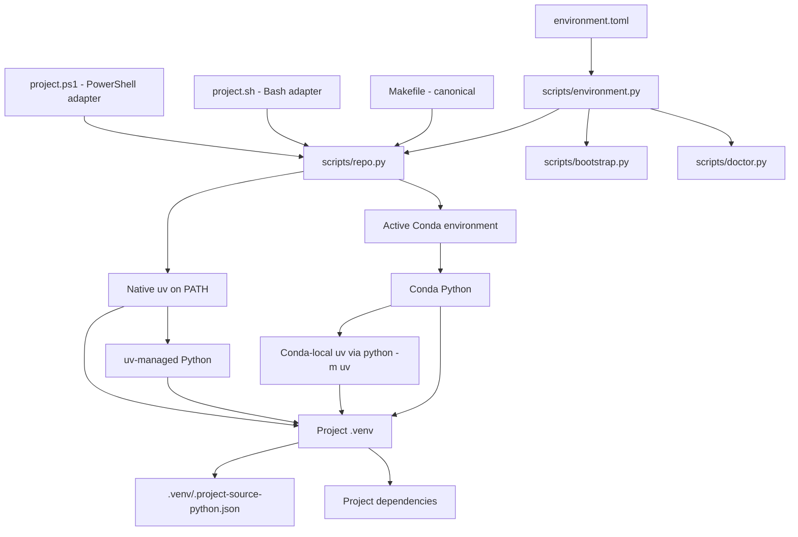

# Environment Contract

## Policy source

`environment.toml` is the declarative environment-policy source.
`scripts/environment.py` is the shared implementation layer that interprets
authority, Python requests, uv discovery, `.venv` paths, and provenance rules.

Two authority modes are supported:

- `authority = "conda"`: the active Conda environment selects Python and uv is
  invoked from that interpreter as `python -m uv`;
- `authority = "uv"`: native uv resolves and manages the configured Python
  request directly.

The reusable scaffold defaults to native uv. Conda remains a first-class alternative selected through the same `environment.toml` contract.

## Authority chain

## Responsibility split

The model keeps three responsibilities separate:

- the configured **authority** selects the source Python;
- **uv** resolves and installs project dependencies;
- the project **`.venv`** isolates the runtime used by application, tests,
  linting, and IDE tooling.

Conda authority is represented by active shell state, which is why the
dispatcher may re-exec under the active Conda Python.

Native uv authority is represented explicitly by the uv executable plus the
managed interpreter it resolves. It does not require an invented active-env
state or dispatcher re-exec.

## Provenance

`make bootstrap` writes `.venv/.project-source-python.json`.

Conda identity records the source interpreter path/version and Conda prefix.
Native-uv identity records the source interpreter path/version and configured uv
Python request. New records also identify `source_authority`.

Legacy Conda records remain valid when their original identity fields still
match.

`make doctor` and normal lifecycle commands compare the project `.venv`
against the configured authority and fail closed on incompatible provenance.

## Shell adapters

`project.sh` and `project.ps1` remain intentionally thin. They perform only
pre-Python startup checks and delegate to `scripts/repo.py`.

Bootstrap, authority resolution, provenance, dependency behavior, and full
diagnostics stay in Python so Make, Bash, and PowerShell do not acquire separate
environment-policy implementations.

See also:

- `docs/architecture/bootstrap-boundary.md`
- `docs/architecture/uv-authority.md`
- `docs/architecture/authority-bootstrap.md`
- `docs/architecture/authority-lifecycle.md`
