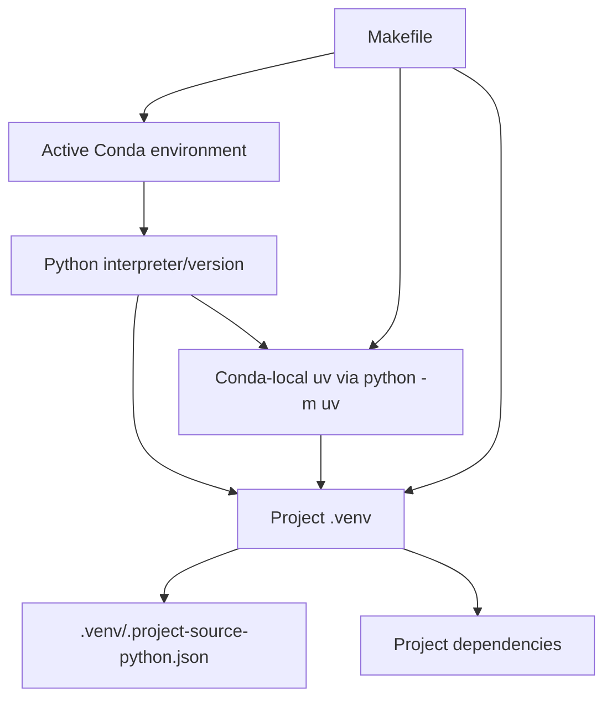

# Environment Contract

## Authority chain

## Why this model exists

The model separates three concerns that are easy to conflate:

- **Conda** chooses the Python runtime.
- **uv** resolves/installs project dependencies quickly.
- **`.venv`** isolates the project dependency set used by normal execution and IDE tooling.

A machine may have other `uv` installations. They are diagnostic context, not project authority.

## Provenance

`make bootstrap` writes `.venv/.project-source-python.json` with the source interpreter path/version and Conda prefix. `make doctor` compares those values with the currently active Conda environment to detect a stale/mis-sourced `.venv`.
