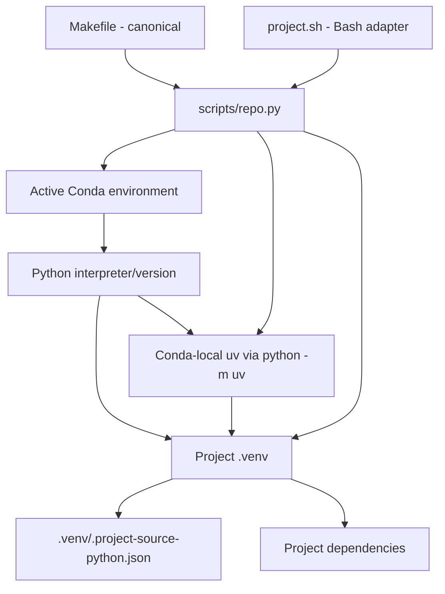

# Environment Contract

## Authority chain

## Why this model exists

The model separates three concerns that are easy to conflate:

- **Conda** chooses the Python runtime.
- **uv** resolves/installs project dependencies quickly.
- **`.venv`** isolates the project dependency set used by normal execution and IDE tooling.

A machine may have other `uv` installations. They are diagnostic context, not project authority. The Makefile and Bash adapter both delegate to the same Python dispatcher so shell choice does not create competing environment behavior.

## Provenance

`make bootstrap` writes `.venv/.project-source-python.json` with the source interpreter path/version and Conda prefix. `make doctor` compares those values with the currently active Conda environment to detect a stale/mis-sourced `.venv`.

## Bash support

`project.sh` provides a Bash-native entry point for Linux/macOS, WSL, and Git Bash/MSYS2 environments. It intentionally performs only shell-safe startup work (strict mode, repository-root resolution, Python command discovery) and then delegates to `scripts/repo.py`. Bootstrap, provenance, dependency, and diagnostic rules therefore remain identical across Make and Bash entry points.
