# Python Scaffolding

## A reproducible development foundation for Python projects

**Environment architecture · Makefile contract · uv/Conda flexibility · diagnostics · CI · preservation**

---

# 1. What the project is

Python Scaffolding is not merely a template repository.

It is a **development contract** that standardizes how a Python project is:

- bootstrapped;
- diagnosed;
- executed;
- tested;
- validated;
- reproduced;
- evolved;
- preserved.

The central idea is simple:

> **Users interact with the project through stable commands while the environment implementation remains replaceable.**

---

# 2. Core design idea

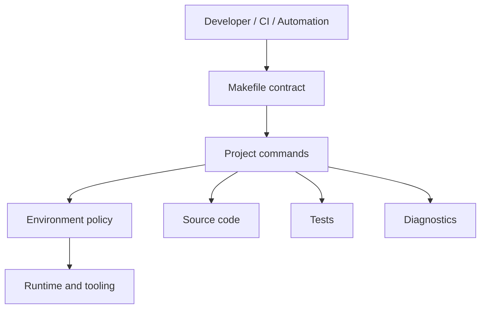

The **Makefile is the public interface**.

Everything beneath it may evolve without forcing the developer to relearn the project.

---

# 3. Why scaffolding matters

A project often fails operationally long before its application logic fails.

Typical causes include:

- wrong Python interpreter;
- stale virtual environments;
- PATH ambiguity;
- hidden machine assumptions;
- drift between Windows, Linux, CI, and developer machines;
- bootstrap scripts that duplicate logic;
- tool installation that cannot be reproduced;
- commands that work only because the developer remembers the correct sequence.

The scaffolding exists to make those assumptions **explicit, inspectable, testable, and replaceable**.

---

# 4. Design principles

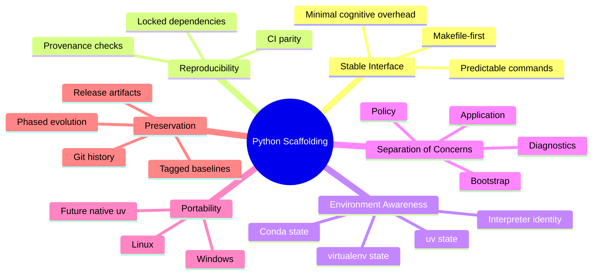

---

# 5. The public contract

The developer should not need to remember which low-level tool performs each action.

The expected interaction looks like this:

```text
make doctor
make setup
make sync
make check
make test
make run
make clean
```

The implementation behind those commands may change.

The contract should not.

---

# 6. Makefile-first architecture

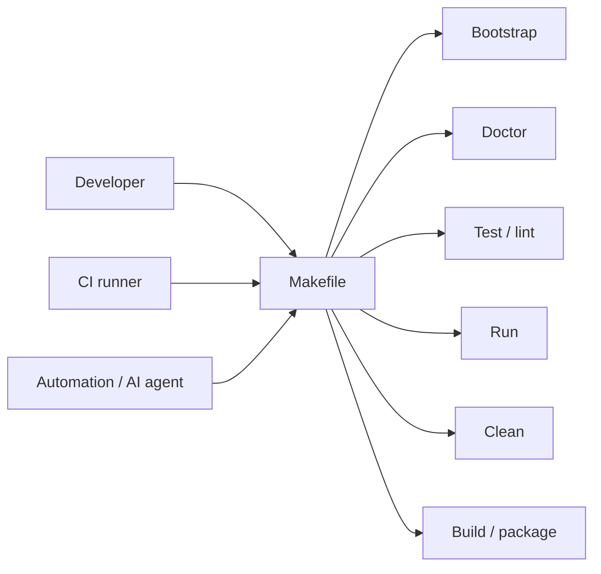

The Makefile acts as an **anti-fragmentation layer**.

Humans, CI, and automation invoke the same contract.

---

# 7. Environment architecture

One of the major architectural shifts was to stop treating environment handling as scattered shell logic.

Instead, environment behavior becomes a defined subsystem.

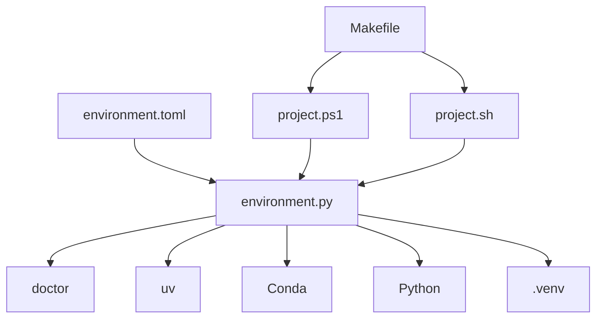

The shell wrappers stay thin.

The policy stays centralized.

---

# 8. Environment authority

The scaffolding separates **environment policy** from **environment implementation**.

This makes multiple strategies possible.

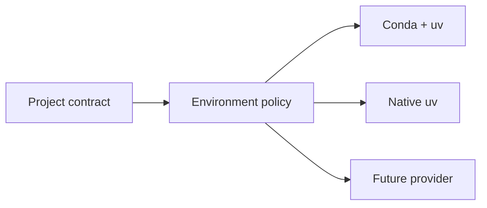

This is the important architectural point:

> The project does not become a “Conda project” or a “uv project”.  
> It becomes a project with a stable environment contract.

---

# 9. Conda + uv mode

The original practical model is intentionally hybrid.

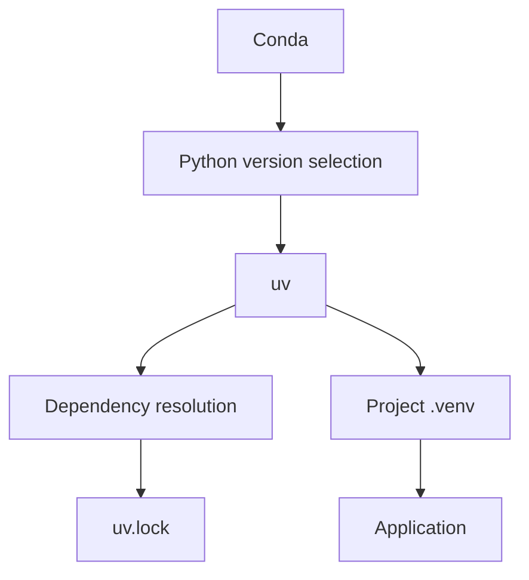

### Responsibility split

- **Conda**: Python version / host environment selection.
- **uv**: project dependencies, locking, synchronization, execution.
- **Makefile**: stable interface.
- **Doctor**: verifies that the selected layers are actually the ones in use.

---

# 10. Native uv mode

Phase 4 introduced the architectural ability to support **uv as authority**.

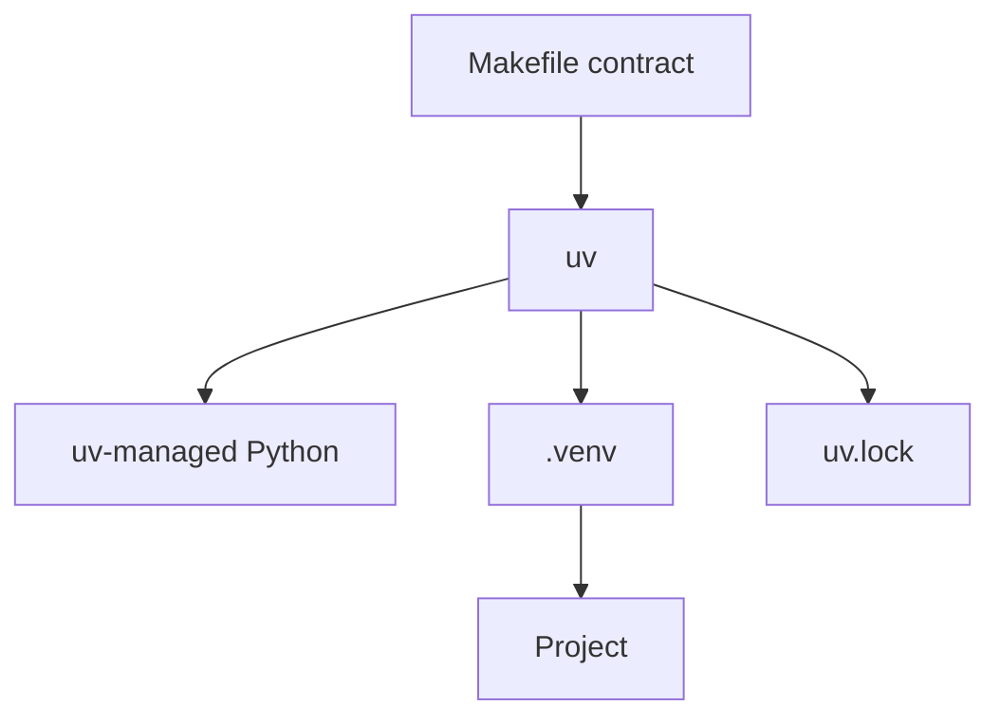

The objective is not merely to “use uv”.

The objective is to prove that **changing the environment authority does not break the project contract**.

---

# 11. Doctor as an architectural component

`doctor` is not just a convenience command.

It is the project’s **environment observability layer**.

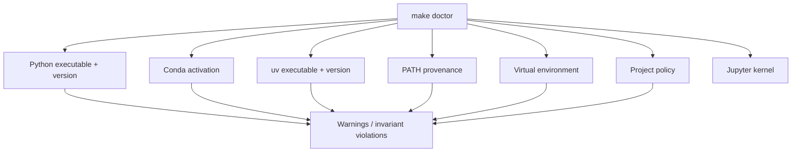

The goal is **provenance**, not merely availability.

“Python exists” is weaker than:

> “This exact Python executable is the one the project expects.”

---

# 12. Bootstrap boundary

Bootstrap logic must remain intentionally small.

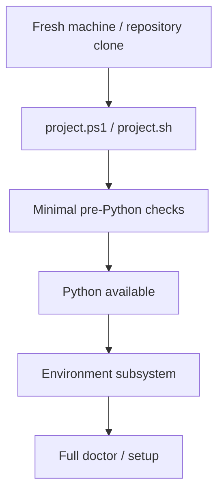

This prevents the classic bootstrap paradox:

> A Python diagnostic cannot diagnose why Python itself is unavailable.

---

# 13. Proposed repository structure

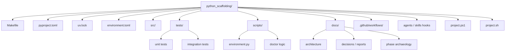

---

# 14. Separation of responsibilities

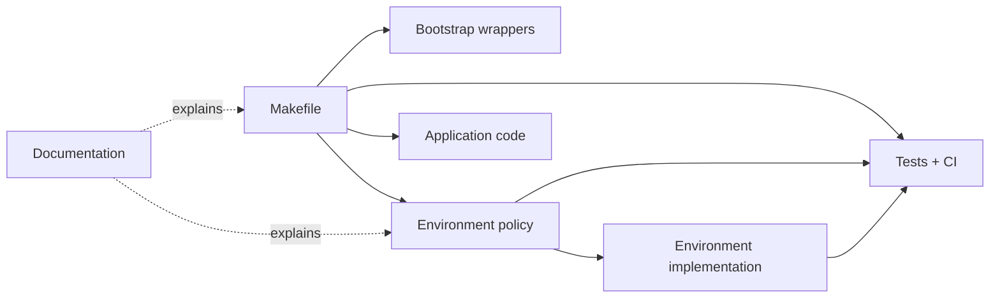

Each layer should have a narrow reason to change.

That reduces accidental coupling.

---

# 15. Phase 0 — Repair the invariants

The first phase fixed the foundation before adding new abstractions.

Key goals included:

- repair license inconsistency;
- repair agent references / validator behavior;
- commit `uv.lock`;
- repair `clean`;
- declare actual Python compatibility;
- verify environment-sensitive command provenance.

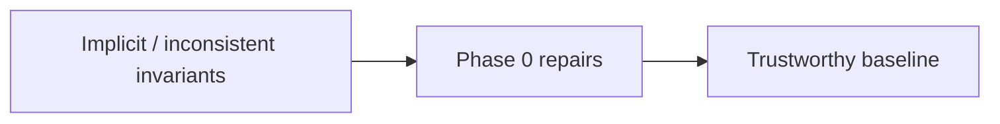

---

# 16. Phase 1 — Extract the architecture

Phase 1 moved environment behavior from scattered implementation details into explicit architecture.

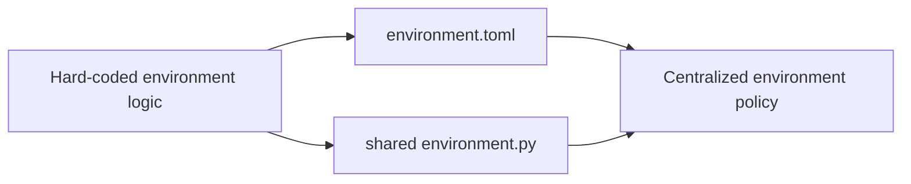

This was the transition from **scripts that happen to work** to **an environment subsystem**.

---

# 17. Phase 2 — Fix bootstrap boundaries

Phase 2 established a clear boundary between:

- shell/bootstrap responsibilities;
- Python diagnostics;
- project logic.

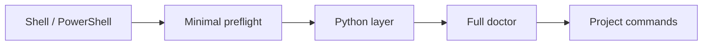

Thin wrappers remain disposable.

The Python implementation remains authoritative.

---

# 18. Phase 3 — Test the scaffold itself

The scaffold must be treated as production code.

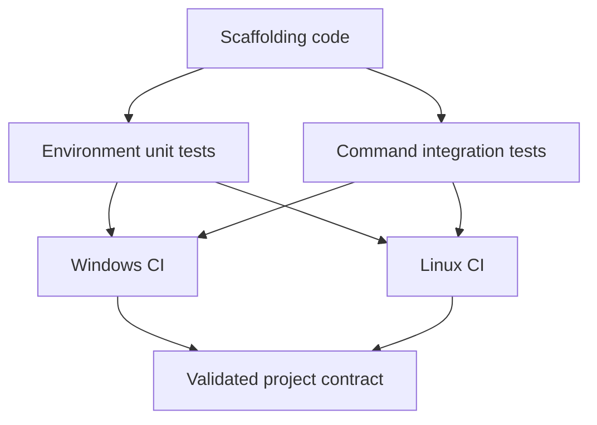

The goal is not only to test applications created from the scaffold.

The scaffold itself must prove that it still behaves correctly.

---

# 19. Phase 4 — Pluggable environment authority

Phase 4 proves the architectural abstraction.

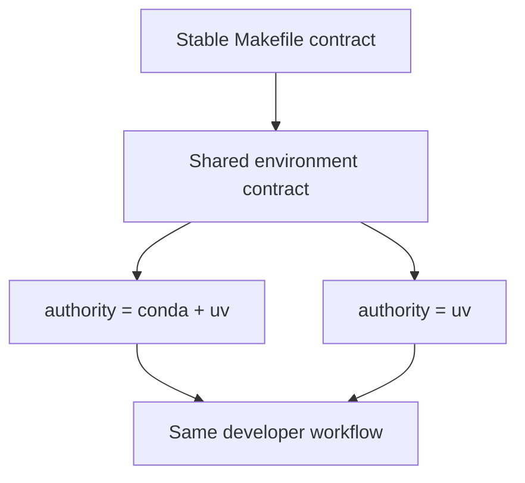

If both modes satisfy the same contract, the abstraction is doing useful work.

---

# 20. Git workflow and software archaeology

The repository treats history as engineering evidence.

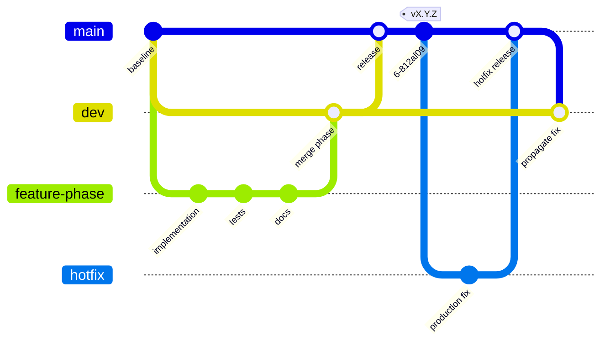

Important principles:

- avoid squash merges when preserving implementation history matters;
- keep phase boundaries visible;
- tag releases semantically;
- document hotfixes;
- keep release artifacts for later archaeology.

---

# 21. Releases as historical checkpoints

A release represents more than a binary version.

It captures:

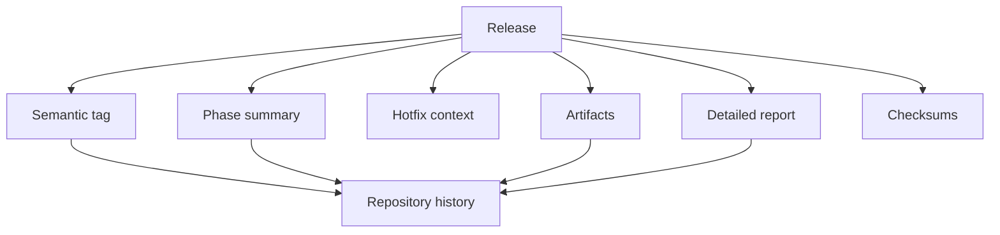

This supports future reconstruction of **what changed, why it changed, and how it behaved**.

---

# 22. Minimal AI / agent integration

The scaffolding may support AI-assisted development without becoming an agent framework itself.

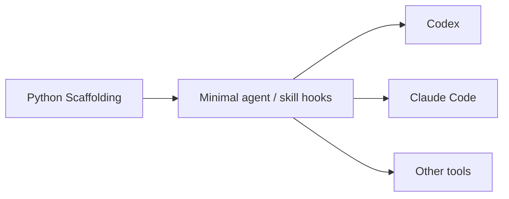

The principle is:

> Keep only the canonical integration surface here.  
> Evolve rich agent architecture elsewhere.

This prevents the scaffolding from becoming overloaded with unrelated responsibilities.

---

# 23. What the scaffold should generate

A future mature scaffold can produce a project with the same contract regardless of application type.

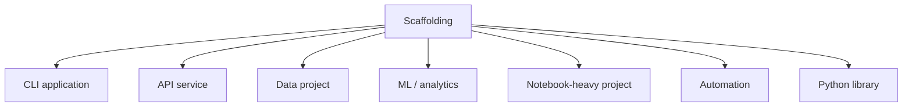

The scaffold standardizes **engineering mechanics**, not business logic.

---

# 24. Project invariants

A good invariant is a rule the project can verify.

```mermaid
flowchart LR
    INV[Project invariants]

    INV --> I1[Commands go through Makefile]
    INV --> I2[Dependencies are locked]
    INV --> I3[Interpreter provenance is known]
    INV --> I4[Environment policy is centralized]
    INV --> I5[CI uses public project commands]
    INV --> I6[Bootstrap wrappers stay thin]
    INV --> I7[History is preserved]
    INV --> I8[Platform differences are explicit]
```

These invariants turn convention into architecture.

---

# 25. Desired developer experience

```mermaid
sequenceDiagram
    participant D as Developer
    participant M as Makefile
    participant E as Environment layer
    participant U as uv / runtime
    participant C as Codebase

    D->>M: make doctor
    M->>E: inspect environment
    E-->>D: provenance + warnings

    D->>M: make setup
    M->>E: resolve policy
    E->>U: create/sync environment
    U-->>E: ready

    D->>M: make check
    M->>C: lint + test + validate
    C-->>D: project status
```

The user interacts with **intent**, not implementation detail.

---

# 26. Architectural philosophy

The scaffold follows several broader software-engineering ideas:

- **Ports and adapters** — the Makefile is a stable entry point while environment providers are replaceable.
- **Dependency inversion** — workflow depends on an environment contract, not directly on Conda or uv.
- **Observability** — `doctor` exposes state and provenance.
- **Reproducibility** — lockfiles, CI, and deterministic commands reduce hidden state.
- **Separation of concerns** — bootstrap, environment policy, diagnostics, application code, and CI remain distinct.
- **Evolutionary architecture** — the system is designed to change providers without rewriting the user workflow.

---

# 27. The scaffold as a platform

```mermaid
flowchart TD
    FOUNDATION[Python Scaffolding]

    ENV[Environment contract]
    EXEC[Execution contract]
    TEST[Testing contract]
    OBS[Diagnostics]
    CI[CI contract]
    DOC[Documentation]
    HIST[Historical preservation]

    FOUNDATION --> ENV
    FOUNDATION --> EXEC
    FOUNDATION --> TEST
    FOUNDATION --> OBS
    FOUNDATION --> CI
    FOUNDATION --> DOC
    FOUNDATION --> HIST

    ENV --> PROJECTS[Future projects]
    EXEC --> PROJECTS
    TEST --> PROJECTS
    OBS --> PROJECTS
    CI --> PROJECTS
```

This is why it is better understood as a **small development platform** than as a template.

---

# 28. Evolution path

```mermaid
flowchart LR
    V1[Working personal scaffold]
    V2[Explicit environment architecture]
    V3[Cross-platform validation]
    V4[Pluggable environment authority]
    V5[Template generation]
    V6[Reusable organization standard]

    V1 --> V2 --> V3 --> V4 --> V5 --> V6
```

The important rule is to evolve only after the previous layer becomes trustworthy.

Architecture should emerge from proven constraints—not from abstraction for its own sake.

---

# 29. What should remain intentionally simple

```mermaid
mindmap
  root((Keep simple))
    Makefile
      Few canonical targets
      Stable naming
    Wrappers
      Thin PowerShell
      Thin Bash
    Configuration
      Explicit
      Human-readable
    Agent support
      Hooks only
      No platform explosion
    Bootstrap
      Minimum logic
      No duplicated policy
```

A scaffold becomes dangerous when the scaffold itself is harder to understand than the projects it creates.

---

# 30. The central architectural loop

```mermaid
flowchart LR
    DEFINE[Define invariant]
    IMPLEMENT[Implement once]
    EXPOSE[Expose through Makefile]
    OBSERVE[Inspect with doctor]
    TEST[Test locally + CI]
    FREEZE[Tag / release / document]
    EVOLVE[Evolve architecture]

    DEFINE --> IMPLEMENT
    IMPLEMENT --> EXPOSE
    EXPOSE --> OBSERVE
    OBSERVE --> TEST
    TEST --> FREEZE
    FREEZE --> EVOLVE
    EVOLVE --> DEFINE
```

This loop captures the project’s engineering philosophy.

---

# 31. Final view

```mermaid
flowchart TD
    USER[Developer]
    CONTRACT[Stable Makefile interface]

    ENV[Environment architecture]
    DIAG[Doctor / provenance]
    TESTS[Tests]
    CI[CI]
    APP[Application code]
    DOCS[Documentation]
    HISTORY[Git + releases]

    USER --> CONTRACT

    CONTRACT --> ENV
    CONTRACT --> DIAG
    CONTRACT --> TESTS
    CONTRACT --> APP

    ENV --> CI
    TESTS --> CI

    ENV --> DOCS
    DIAG --> DOCS
    TESTS --> DOCS

    DOCS --> HISTORY
    CI --> HISTORY
```

## Python Scaffolding

**A reproducible, inspectable, evolvable development contract.**

Not just a place to start a Python project.

A way to make projects behave predictably as they grow.